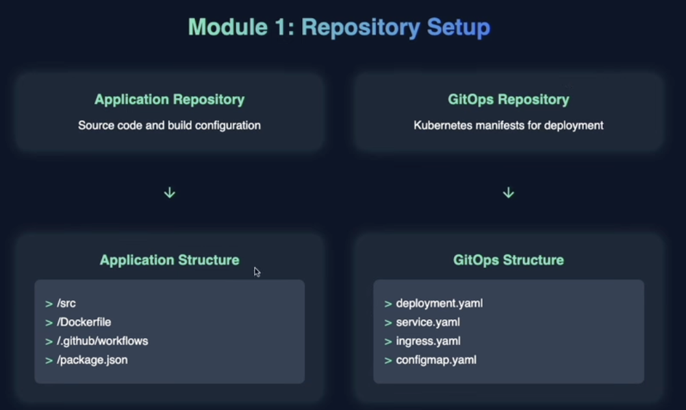

# Build complete Kubernetes CI/CD 
Pipeline with GitHub and ArgoCD.

## Module 1: Repository Setup
We are going to start by setting some thing up, main application repo as well as the GitOps Repo which we're goign to use to setup the foundation for the Pipeline we're going to build.

## Module 2
Start by building the first piece of the pipeline, and going to configure GH Actions to build images automatically and deploy them to a container registry as soon as we make any code changes to the main application.

## Module 3
Finall pipeline is to setup a GitOps Repo which is updated as soon as there's a new image in the container registryArgoCD which is going to be running in our K8S Cluster, will monitor the GitOps Repo for any changes. If it sees that there is a new image, its going to reconcile with the desired state with whatever current state we have in our K8S Cluster and automate the deploymnets.

## Module 3
Automate all from Module 1 through 3.

---

# Reposiroty Setup



In here we are going to setup the Repo needed to setup our CI and CD Pipeline, so the CI Part of our pipeline is going to live in the application repository and the CD part of our pipeline will live in the GitOps Repository.

CI -> Whenever a change is made to your code base that needs to trigger some sort of automated build. 
In our code example, application repo has a web application that we're goint to make changes to. The CI part of our pipeline is going to live there as soon as we make changes to it that's goign to trigger an automated build in such a way that its going to repackage all of this code into a Docker image, store that image into a container registry and then update the GitOps repository to link to that new image.

Now the CD part of the pipeline happens, when you update the GitOps Repo, such that when we update it to point to a new image ArgoCD is going to monitor the GitOps repo and automatically redeploy all of the K8S manifest inside of the K8S cluster.

All together to have a complete workflow where any code change is going to result in an audit at deployment within our kubernetes cluster.

Repo-1: [Application Repo](/Kubernetes/CICD-Lab-1/)
```bash
|
|-- .github
    |-- workflows
        |-- ci-pipeline.yml
|-- src
    |-- app.py
|-- Dockerfile
|-- requirements.txt
|-- README.md

```

Repo-2: [GitOps-Repo]()
```bash
|-- deployment.yaml
```


