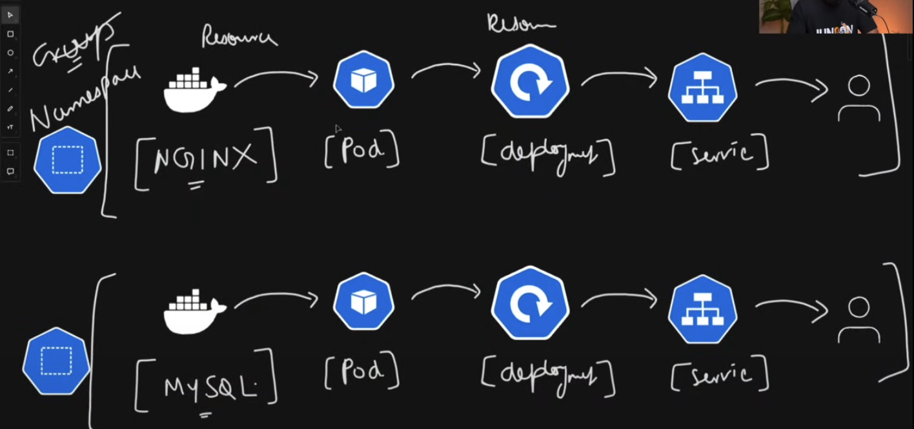

**Index**
- [Kubernetes](#kubernetes)
- [Core Concepts:](#core-concepts)
- [Workloads](#workloads)
- [Networking](#networking)
- [Storage](#storage)
- [Communication between Master Node and Worker Node](#communication-between-master-node-and-worker-node)
- [CNI - Container Network Interface](#cni---container-network-interface)
- [Ways to Setup K8S](#ways-to-setup-k8s)
- [K8S setup on EC2 Instance](#k8s-setup-on-ec2-instance)
- [How to switch kubectl clusters between gcloud and minikube](#how-to-switch-kubectl-clusters-between-gcloud-and-minikube)
    - [Common Docker Images](#common-docker-images)
    - [Finding Docker Images](#finding-docker-images)
    - [Using Your Own Docker Image](#using-your-own-docker-image)


# Kubernetes
[TrainWithSubham](https://www.youtube.com/watch?v=W04brGNgxN4)
# Core Concepts:
* Monolithic Vs Microservices
* Kubernetes Architecture
* Setup on Local / AWS EC2.
* Kubectl; Pods; Namespaces; Labels; Selectors; Annotations.

# Workloads
* Depoyments
* StatefulSets
* DaemonSets
* ReplicaSets
* Jobs
* CronJobs

# Networking
* Cluster Networking
* Servoces
* Ingress
* Network Policies

# Storage
* Presistent Voleumes (PV)
* Persistent Volume Claims (PVC)
* StorageClasses
* ConfigMaps
* Secrets

# Communication between Master Node and Worker Node


# CNI - Container Network Interface
CNI stands for Container Network Interface. In Kubernetes, which is a system for managing containerized applications, the CNI network is a set of standards and plugins that help connect containers with one another and with the outside world.

Imagine you have a house (this is your Kubernetes cluster), and inside this house, you have many rooms (these are your containers). Each room needs to be connected to the house's plumbing and electrical systems (networking), so people can communicate and resources can flow. The CNI is like the blueprint and toolkit that makes this possible. It ensures every room has proper connections to send and receive information.

So, in essence, the CNI in Kubernetes ensures your containers can communicate with each other and access the wider network smoothly and efficiently, just like connecting rooms in a house.

# Ways to Setup K8S
* Kubeadm --> Take 2 or more EC2 (VMs) Instances, install kubeadm on all EC2 Instances, and attach with each other. 
* Minikube --> good for local setup or on single EC2 instance.
* KIND (Kubernetes IN Docker) Cluster --> Runs K8S under Docker.
* Cloud Managed Services --> EKS / AKS / GKE.

# K8S setup on EC2 Instance
1. Create EC2 instance with T2-Medium or Large.  
2. [Refer Steps](https://github.com/LondheShubham153/kubestarter/tree/main/kind-cluster#1-installing-kind-and-kubectl)


# How to switch kubectl clusters between gcloud and minikube
[Refer](https://stackoverflow.com/questions/43643463/how-to-switch-kubectl-clusters-between-gcloud-and-minikube)
I have Kubernetes operating well in two different environments, namely in my local environment (MacBook running minikube) and as well as on Google's Container Engine (GCE, Kubernetes on Google Cloud). I use the MacBook/local environment to develop and test my YAML files and then, upon completion, try them on GCE.

Currently I need to work with each environment separately: I need to edit the YAML files in my local environment and, when ready, (git) clone them to a GCE environment and then use/deploy them. This is a somewhat cumbersome process.

Ideally, I would like to use kubectl from my Macbook to easily change between the local minikube or GCE Kubernetes environments and to easily determine where the YAML files are used. Is there a simple way to switch contexts to do this?

Answer: You can switch from local (minikube) to gcloud and back with:

kubectl config use-context CONTEXT_NAME

to list all contexts:

kubectl config get-contexts

You can create different enviroments for local and gcloud and put it in separate yaml files.

[Related documentation](https://kubernetes.io/docs/tasks/access-application-cluster/configure-access-multiple-clusters/).


-------->
Working flow


--------------

what impact it will have if i stop my minikube cluster from running?
Stopping your Minikube cluster using minikube stop will shut down the underlying virtual machine or container, but your cluster data and state will be preserved. 
In essence, your cluster will be paused, and you can restart it later using minikube start to restore it to its previous state.
In contrast, deleting the cluster (minikube delete) would remove all cluster data and configurations. 
In short, stopping your Minikube cluster temporarily pauses it, allowing you to reclaim resources without losing your cluster's state. 

minikube stop ==> Stops a local Kubernetes cluster. This command stops the underlying VM or container, but keeps user data intact. The cluster can be started again with the “start” command.

-------------

Q: using `kubectl run nginx --image=nginx` what different images I could use? Where to find the images I can use? Can I have my own Docker Image?

You can use a variety of images with the `kubectl run` command. Here are some examples:

### Common Docker Images
- **nginx**: `kubectl run nginx --image=nginx`
- **nginx:1.16**: `kubectl run nginx --image=nginx:1.16`
- **nginx:1.17**: `kubectl run nginx --image=nginx:1.17`
- **busybox**: `kubectl run busybox --image=busybox`
- **ubuntu:22.04**: `kubectl run ubuntu --image=ubuntu:22.04`
- **alpine**: `kubectl run alpine --image=alpine`

### Finding Docker Images
You can find Docker images on **Docker Hub**, which is the world's largest container registry. Here's the link to Docker Hub: [Docker Hub](https://hub.docker.com/). You can search for images, manage repositories, and even create your own private repositories.

### Using Your Own Docker Image
Yes, you can use your own Docker image! To do this, you'll need to:
1. **Build your Docker image**: Create a Dockerfile and build the image using the `docker build` command.
2. **Tag your Docker image**: Tag your image with a suitable name and version.
3. **Push your Docker image to a registry**: Push the image to a registry like Docker Hub or a private registry.
4. **Pull your Docker image**: Use the `kubectl run` command with the image name you pushed.

Here's an example:
```sh
docker build -t my-custom-image:v1 .
docker push my-custom-image:v1
kubectl run my-pod --image=my-custom-image:v1
```

Does this help clarify things for you?


--------------------

* Replication Controller --> 
* ReplicaSet / SatefulSet / Deployment 
    * Get difference mainly focusing on replicas.
    * Deployment does rolling update.
* Label & Selector --> 
* Jobs and CronJob
* Different status of Pod (lifecycle of Pods) --> container creating; running; terminating; completed.
* Volume -->
  * Persistent Volume
  * 

