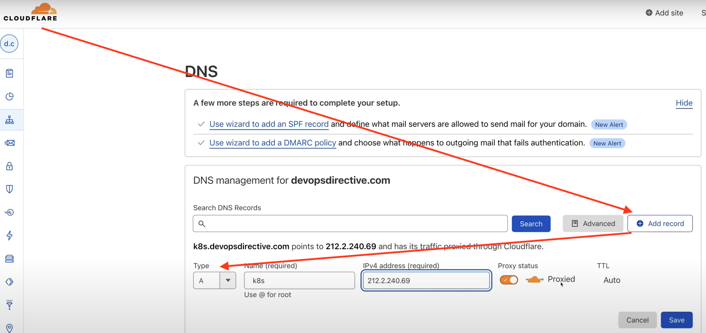

Source: https://www.youtube.com/watch?v=XltFOyGanYE


1. Create Simple App "app/main.py"
2. Containerize a simple application
3. Push to container registry
4. create cluster
5. create k8s resource definitions
6. apply resources
7. add DNS records
8. validate
9. Demo Load Balancing

---
1. Create Application "app/main.py"
2. Install Requirements `pip install -r requirements.txt`.
3. Run from locally: `uvicorn main:app --reload`
4. Open browser and hit `localhost:8000`
5. CHange the code and save, should reload the app, refresh the web page to see latest changes.
6. Build Docker Image
```bash
docker build -t k8s-fast-api .
```
7. Run Container locally, for this we will port-forward from my local host 8000 to port 80 inside that container.  
Up here we're telling it to run on port 80 inside the container, and in order to be able to access the network inside that container I need to connect my local (macBook) with the host of the container itself. Doing so by using "-p" port-forwarding.
```bash
docker run -p 8000:80 k8s-fast-api
```
With this port-fowarding we could still access the http get request page using same 8000 port. Same as step # 4.
`localhost:8000`

8. Now lets modify our "main.py" to include ENV variables.
9. To Use DockerHub (or any other Registry) use image accordingly. Now Nuild the image again and push to DockerHub.
```bash
docker build -t mayanktripathi4u/k8s-fast-api:0.0.1 .

docker push mayanktripathi4u/k8s-fast-api:0.0.1 
```
10. Create K8S mainfest yaml file as "deployment.yaml".
11. Create K8S mainfest yaml file as "service.yaml"
12. Apply the deployment and service mainfest yaml.
```bash
cd /Users/tripathimachine/Desktop/Apps/GitHub_Repo/Kubernetes/Python-FastAPI/kubernetes/

kubectl apply -f .
# Above either we could one file at a time... alternatively provide the Dir path, and let it pick all files from there.
```
13. Once all are running... verify. Before proceeding use port-forward.
```bash
kubectl port-forward fast-api-6b55fb995f-temd08 8080:80
```
14.  After this port-fowarding we could still access the http get request page using same 80 port. 
`localhost:8000`

15. Modify the "deployment.yaml" file to include ENV and its value as "K8S".
Redeploy / apply again the mainefest file.
```bash
kubectl apply -f .
```
16. Port-Forward again, once all pods are up & running.
```bash
kubectl port-forward fast-api-6b55fb995f-temd08 8080:80

kubectl get pods
```
and then access browser `localhost:8000`

17. Finally our code is running in the Cluster, but its not currently not accessible to the world. So we have to figure out a way to get traffic from the Public Internet into our cluster.
For this, we have to use `ingress` which is a type of controller.
**Ingress** exposes HTTP and HTTPS routes from outside the cluster to services within the Cluster. Traffic routing is controlled by rules defined on the ingress resource.

18. Create `ingress.yaml`.
19. Deploy the changes again, either just the ingress.yaml or all the mainefest yaml files.
```bash
kubectl apply -f .
```

```bash
kubectl get ingress
```

Next is to get the Public IP Address of our Cluster, so that we can route traffic to that. 
Get the External IP address.

For this one of the option is to connect to CLOUDFLARE, where we would have DNS setup for specific Domain.
Create "A Record" under DNS.



Now should we able to access from anywhere using "http://k8s.devopsdirective.com" per above example. Change the Domain where required.


# Debug
Lets go into the container, we can get an executable env inside the container.

```bash
kubectl get pods

kubectl exec -it fast-api-6576cbdd-74fpq -- bash
# use the pod id above.
```
Above command will open the bash of the container.
```bash
echo $HOSTNAME

# open python terminal
python

>>> import os
>>> os.environ
>>> print(os.environ.get("HOSTNAME"))
>>> exit

exit
```

# Deploying next version
Once making any change to code, we have to redeploy.

```bash
docker build -t mayanktripathi4u/k8s-fast-api:0.0.2 .

docker push mayanktripathi4u/k8s-fast-api:0.0.2 

# Make sure to update the Version change in deployment.yaml to reflect the correct image.
cd kubernetes

kubectl apply -f .

kubectl get pods
```