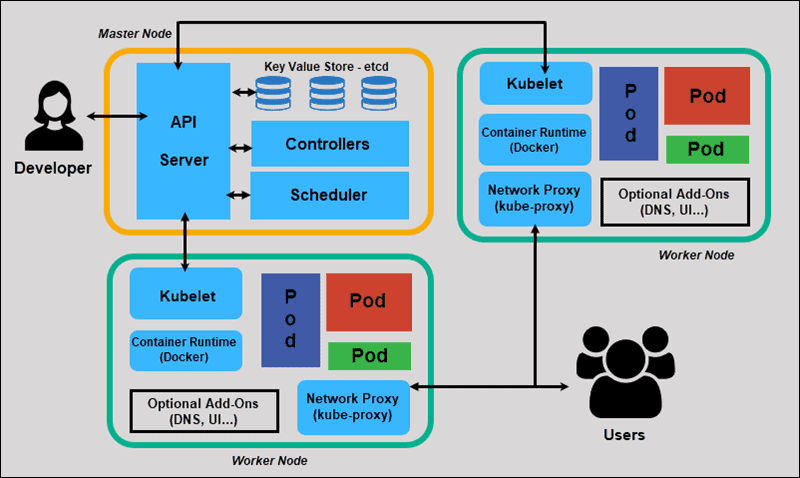
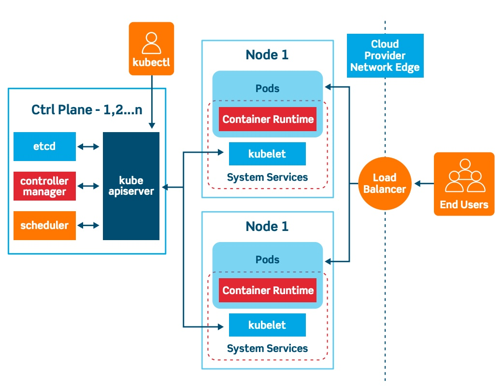

- [Introduction](#introduction)
- [Prerequisites](#prerequisites)
- [Need of Kubernetes](#need-of-kubernetes)
- [Architecture](#architecture)
  - [Flow](#flow)
- [Kubernetes in Layman Terms](#kubernetes-in-layman-terms)
  - [Kubernetes as a Container Orchestra](#kubernetes-as-a-container-orchestra)
  - [Key Components of Kubernetes Architecture](#key-components-of-kubernetes-architecture)
  - [How the Kubernetes Architecture Interacts (Flow of a Request)](#how-the-kubernetes-architecture-interacts-flow-of-a-request)
  - [In-Short](#in-short)


This is my personal learning tutorial on Kubernetes, I will be adding all the essential information needed to understand and work with Kubernetes, including the use of APIs, installation, and Kubernetes cluster construction. 

# Introduction
* Kubernetes is a tool that helps us to run and manage applications in containers. 
* It was developed by Google Lab in 2014, and it is also known as `k8s`. 
* It is written in Golang and has a vast community because it was first developed by Google and later donated to CNCF (Cloud Native Computing Foundation). 
* It is an open-source container orchestration platform that automates the deployment, management, and scaling of container-based applications in different kinds of environments like physical, virtual, and cloud-native computing foundations.
* Kubernetes is an open-source platform that manages Docker containers in the form of a cluster. Along with the automated deployment and scaling of containers, it provides healing by automatically restarting failed containers and rescheduling them when their hosts die. This capability improves the application’s availability.
* Kubernetes is an open-source Container Management tool that automates container deployment, container scaling, descaling, and container load balancing (also called a container orchestration tool).
* Containers are isolated from each other so that multiple containers can run on the same machine without interrupting anyone else. 
* It allows us to deploy and manage container-based applications across a Kubernetes cluster of machines.
* Kubernetes is like a ship captain for containers, organizing and placing them on multiple computers (like a ship carrying many containers). 
* Kubernetes can group ‘n’ number of containers into one logical unit for managing and deploying them easily. 
* It works brilliantly with all cloud vendors i.e. public, hybrid, and on-premises. 

# Prerequisites
Before diving into Kubernetes, it’s essential to have a solid understanding of certain concepts and technologies. Here are some prerequisites:

* Have good understanding of Container concept & Container Management Tool like Docker or Podman.
* Understanding of distributed system.
* Understanding of REST API
* Basic understanding of YAML

# Need of Kubernetes
There are several reasons to use Kubernetes like 
* easy scaling of applications, 
* self-healing, portability, and 
* automation. 

It is very helpful for running microservices and distributed systems.

**For example** : You have a couple of applications to deploy so, you can package it into a container and run it on a server containing a Docker engine or any other container engine. You package the application into a container using a Docker file and host it on a port for the external world to access it.

But there is a drawback is that it is only running on a single server so, if at that point any failure occurs it becomes an application failure, to handle the single point of failure google introduced Kubernetes to scale applications.

# Architecture





## Flow
Kubernetes (K8s) operates with a series of components that work together to manage containerized applications. Here’s an explanation of the components you listed, their purposes, and how a request flows through them:

1. User sends the request to Kubernetes to run the application named as "nginx" with the image as "nginx". (nginx is a web server). Command used is
```bash
kubectl run nginx --image=nginx
```
   * This request is sent to `API Server`
2. All communication with Kubernetes will start with the `API Server` which is one of the part of `Control Plane`.
   When this API server receives the request, the very first thing it will do is Authenticate, followed by Authorization and Admission (which is 3-A's)
   * User is Authenticated with the header passed.
   * Authorized using RBAC
   * Admission: Webhook to validate and mutate (check if need to pull from registry etc.)
   * Save to `etcd`
3. Once all is validated (3-A's), then the request is picked by `Scheduler`. 
   * Scheduler keeps checking or communicating with `API Server` to check for any new request.
   * Scheduler try to find the best node based on different mechanism like taints / tolerations, affinity, nodeseletctor and finally updates the pod specs (yaml file) with node.
   * 
4. Next comes the `Controller Manager` which provides extensibility to Kubernetes.
   * This service make sure actual state is equal to the desired state.
   * These are `Watch Loops`, to continously monitor a specific object, and whenever determines any changes bring it back to desired state.
   * To name a few controllers -- ReplicaSet; Deployment; Job; statefulset; daemonset
5. Next is `etcd`, which is a key-value store.
   * Key-Value store for distributed system.
   * Similar to other Key-Value stores or any other stores like MySQL; SQLite.
   * In K8s (Kuberenetes) `etcd` is default store, and is swapable.
   * API Server writes to it.
   * In HA (High Availability), 3 etcd node where 1 is leader 
   * RAFT algo (leader election) -> (2n + 1)
6. After the `Scheduler` the request or task will get assign to `Worker Node`. A `worker node` is a machine (physical or virtual) that runs application workloads. It hosts the necessary components (Kubelet, kube-proxy, and container runtime) to run Pods and communicate with the control plane.
   * kube-proxy maintains network rules on nodes. These network rules allow network communication to your pods from network session inside or outside of your cluster.
   * Every time a pod is created, the ip-table is handled by kube-proxy.
7. dd


# Kubernetes in Layman Terms
Let's break down Kubernetes in layman terms by comparing it to a **real-world** system and explaining how everything works together.

## Kubernetes as a Container Orchestra
Imagine you're organizing a large concert, and your job is to make sure everything runs smoothly — from the sound systems, lights, and performers to the audience. You can think of Kubernetes as a `director managing` all the moving parts of the concert. It ensures everything runs in the right place at the right time, even if some parts fail or need to be moved.

**In the Kubernetes world:**

* Containers are like the performers (individual apps or services) that do the work.
* Nodes (servers) are the stages where the performance happens.
* Kubernetes is the system (the director) that coordinates everything to ensure the concert goes off without a hitch.

## Key Components of Kubernetes Architecture
To understand how everything works together, let's break it down into simple components.

1. User (You)
You, the user, interact with Kubernetes to deploy, monitor, and manage your applications (containers). You don’t have to manually manage the individual containers — Kubernetes does that for you.

* How you interact:
  * You communicate with Kubernetes using a command-line tool (kubectl), a web interface (like the Kubernetes Dashboard), or through APIs.
  * You define the desired state of your application (e.g., "I want 3 copies of my app running") using configuration files called manifests (written in YAML or JSON).

2. Kubernetes Master (Control Plane)
This is the brain or director of Kubernetes, responsible for managing the overall system. It makes global decisions about the cluster (like where to run apps, when to scale, and how to fix problems). The Master contains several key components:

* **API Server**: The central point of contact for all user interactions. Whenever you issue a command (via kubectl or any other tool), it sends the request to the API Server. The API Server then interprets your request and makes sure it’s implemented across the system.

* **Controller Manager**: Responsible for monitoring the state of the cluster and making sure the actual state matches the desired state. For example, if you want 3 instances of a web service running, but only 2 are running, the Controller Manager will create an additional instance.

* **Scheduler**: Decides which Node (server) should run the containers based on available resources (CPU, memory, etc.) and current load. It’s like a manager deciding which stage a performer should be on.

* **Etcd**: A key-value store that holds all the cluster’s configuration data (like where each container is running, how many replicas, etc.). It's like a big notebook where Kubernetes writes down everything it knows about the state of the cluster.

3. Kubernetes Nodes (Worker Machines)
These are the machines (virtual or physical) where the actual containers (apps) run. Each node is like a stage at the concert where performers (containers) go to do their work. Each node has:

* **Kubelet**: This is like the stage manager for each node. It makes sure the containers on that node are running as expected, based on the instructions from the Master.
* **Container Runtime**: The software responsible for running the containers (e.g., Docker or containerd).
* **Kube Proxy**: This is responsible for handling network traffic to and from containers. It ensures that when someone wants to talk to your app, the request is routed to the right container.

4. Pods
A Pod is the smallest deployable unit in Kubernetes. A Pod can run one or more containers that share the same network and storage resources. It's like a single performance stage where a group of performers (containers) work together as part of a larger show.

* Each Pod can be thought of as a "logical host" for your containerized applications. It ensures that the containers inside it can share resources and communicate with each other easily.

## How the Kubernetes Architecture Interacts (Flow of a Request)
Let’s walk through a simplified example of what happens when a user wants to deploy a new app or send a request to an existing app running on Kubernetes.

**Step-by-Step Flow:**
1. User Interacts with Kubernetes API:

* You, the user, send a request (e.g., "I want to deploy an app") to Kubernetes using a tool like `kubectl` or via an API.
* Your request is sent to the API Server (the gateway to the system).

2. API Server Communicates with the Controller:

* The `API Server` receives the request and stores it in the `etcd` (which acts as a persistent database).
* The `Controller Manager` regularly checks the desired state in `etcd` to make sure everything is correct. If something is missing (e.g., your app isn’t running), it makes the necessary changes to match the desired state.

3. Scheduler Decides Where to Run the App:

* The `Scheduler` looks at the available nodes (worker machines) and decides where the app should run. It considers the available resources (e.g., CPU, memory) to avoid overloading a node.

4. Pod Creation on a Node:

* The `Controller Manager` creates a new `Pod` based on the configuration you specified (e.g., which container image to use, how many replicas).
* The `Kubelet` on the selected `Node` receives the instruction to create the new `Pod`. The `Kubelet` ensures that the necessary containers are pulled from the container registry (like Docker Hub) and launched.

5. Container Runs Inside the Pod:

* Once the container is up and running inside the Pod, the `Kube Proxy` takes care of routing network traffic to the Pod. For example, when someone wants to visit your app, the `Kube Proxy` will direct that traffic to the right container within the Pod.

6. App is Running and Scalable:

* As your app is running, the `Controller Manager` will continue to monitor the app and ensure the desired number of instances (replicas) are running.
* If a container fails or crashes, Kubernetes will automatically restart it or spin up a new one to ensure the system stays healthy and scales as needed.

## In-Short
* You, the user, interact with Kubernetes via the `API Server` to request actions like deploying applications or scaling services.
* Kubernetes runs your apps in `Pods`, which are managed by Nodes (worker machines).
* The `Control Plane` (including the `API Server`, `Scheduler`, `Controller Manager`, and `etcd`) manages the overall system and ensures the right state is achieved.
* The `Kubelet` on each `Node` ensures that containers are running properly.
* The `Kube Proxy` ensures that network traffic is routed correctly to your containers.
